# k-media
Algoritmo K-Medias implementado en Python
Se realizó un análisis de agrupación por K-Medias a una base de datos de manera tal se puedan generar conclusiones de acuerdo a diversas categorías.

# pre-requisitos
Extrae en línea la base de datos “Iris.csv” y agrégala a un DataFrame en Python. 
# lo que se espera
Agrupa las observaciones de la tabla descargada mediante el algoritmo de K-Medias sin realizar ningún tipo de transformación de los datos originales. Para dicho efecto, determina el número óptimo de clusters tanto por el criterio del gráfico de codo así como por el indicador Silhouette.

Repite el ejercicio anterior después de haber transformado tus datos originales a dos columnas, mediante reducción por PCA. Grafica los grupos obtenidos considerando las dos dimensiones resultantes.

**comparación de resultados**

Compara los resultados. ¿Obtuviste los mismos resultados de agrupamiento? Comenta sobre la ventaja práctica de haber efectuado la transformación por PCA antes de aplicar el algoritmo K-Medias.
# paso a paso
1.	Importamos todas las paqueterias necesarias
2.	Importamos el archivo de iris
 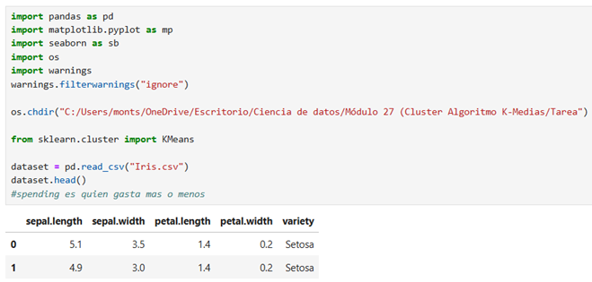

3.	Tomamos sólo las columnas que son numéricas y creamos el DataFrame
 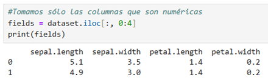

4.	Calculamos la inercia que hay en los puntos para k-means
5.	Creamos una lista vacia:  la suma de las distancias de cada punto hacia su centroide;medir qué tan “compactos” son los grupos. Mientras más pequeño, mejor agrupados están los datos
6.	Probamos con diferentes números de clústeres (cuántos grupos convienen para los datos)
7.	La parte de “init="k-means++": es una forma más inteligente de elegir los puntos iniciales (centroides) para que el algoritmo empiece mejor.

 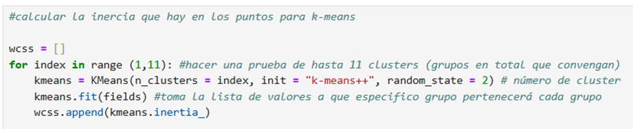

8.	Ahora vamos a realizar la graficación del "codo de Jambu" para determinar en que momento podemos determinar un # óptimo de clusters, en este caso es el valor de 3

 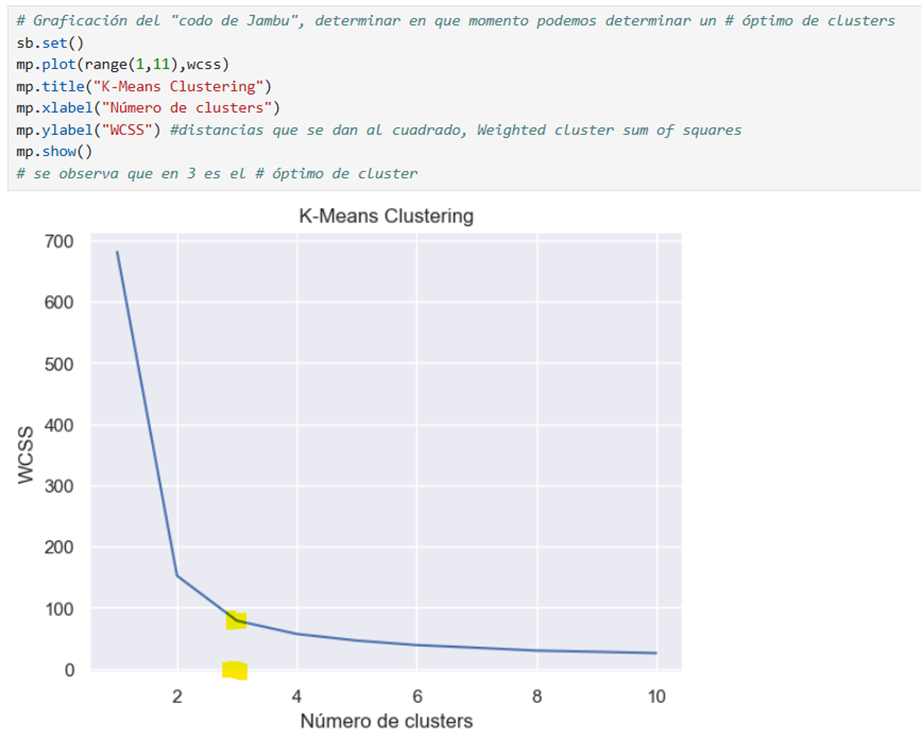

9.	Una vez teniendo el óptimo que en este caso fue de 3 procedemos a realizar el mismo proceso para obtener los valores de la categorización
 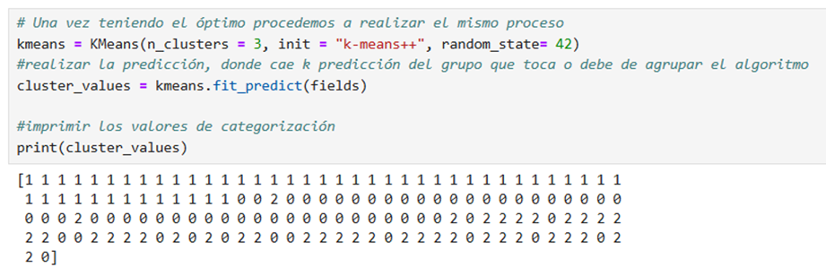
10.	Realizamos las graficas tanto para petalos como sepal
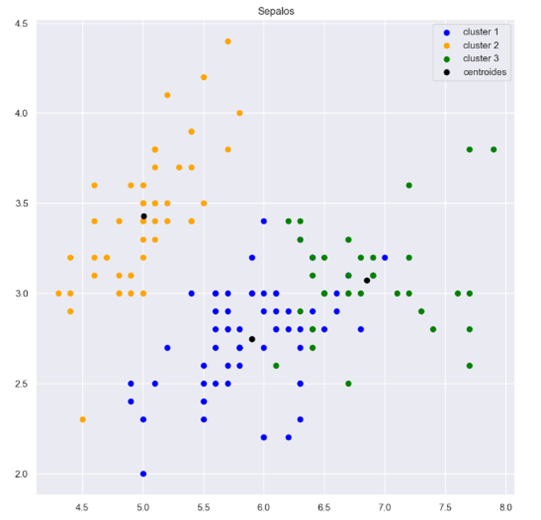
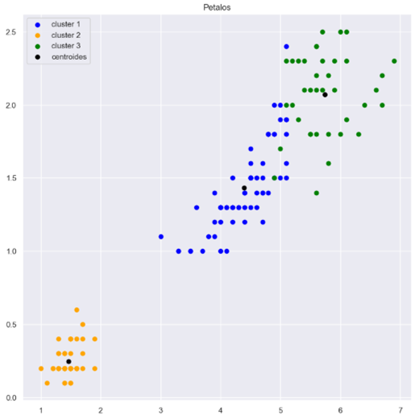
11.	Procedemos determinar el número de grupos óptimos por el criterio de la silueta, el cual coincide con el número óptimo que habíamos determinado que en este caso fue de 3
 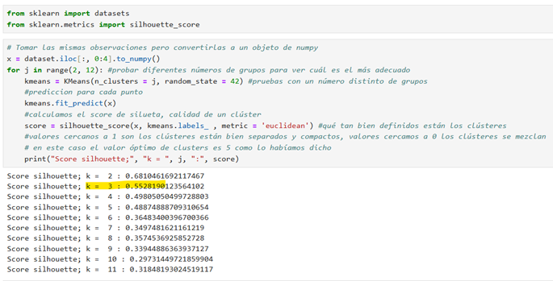
12.	Ahora procedemos a realizar el mismo ejercicio sólo que ahora aplicaremos el algoritmo PCA para minimizar las columnas 
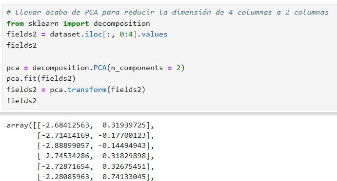
13.	Procedemos a realizar el mismo proceso sólo que ahora con el apoyo del algoritmo PCA para reducir las columnas y graficamos el codo donde observamos nuevamente que el 3 es el óptimo
 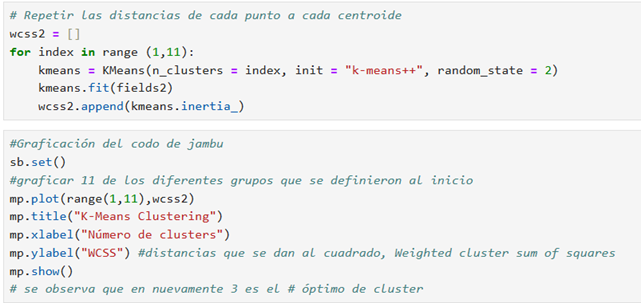
 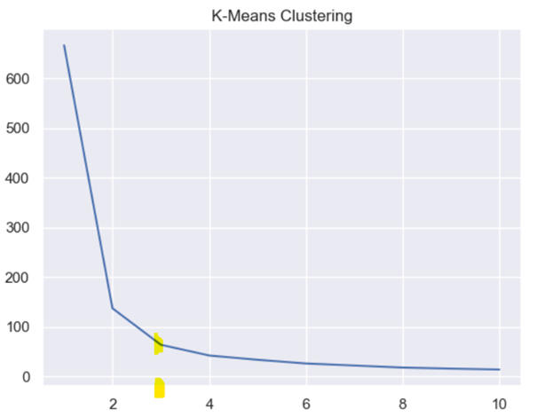
14.	Procedemos a graficar para ver el agrupamiento
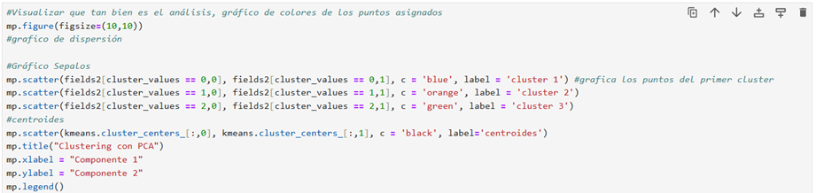
 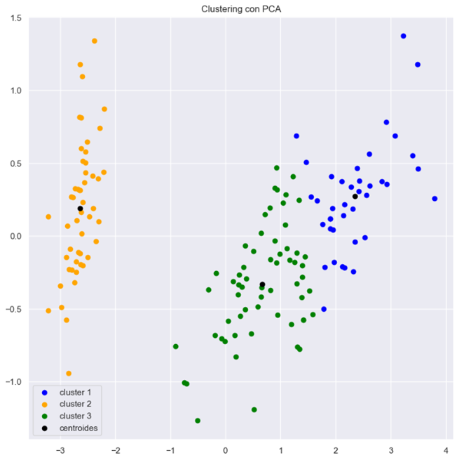
 

# conclusiones

Al aplicar primero el método de K-Means sobre las variables originales que en este caso fueron las de sépalos y pétalos, se observa una agrupación razonable, sin embargo, existe cierta superposición entre clústeres, especialmente en el gráfico de sépalos, por lo que no fue tan “limpio” el como se generaron los grupos ya que habían ciertas variables mezcladas en otros grupos.
Ahora al aplicar PCA para reducir las 4 variables a 2 componentes principales, los clústeres se visualizan de forma más clara y separada. Con esto podemos decir que gracias al algoritmo de PCA se logró realizar una mejor separación de los grupos facilitando la tarea de agrupamiento.
La ventaja de PCA es que permite reducir la dimensionalidad del conjunto de datos, lo que ayuda a concentrar la información más relevante en menos variables. Ayuda con teener una  mejor separación de clústeres; al igual que los grupos se visualizan de forma más clara y compacta.
Al reducir a dos componentes principales facilita la interpretación de los clústeres porqué están más definidos y separados.
